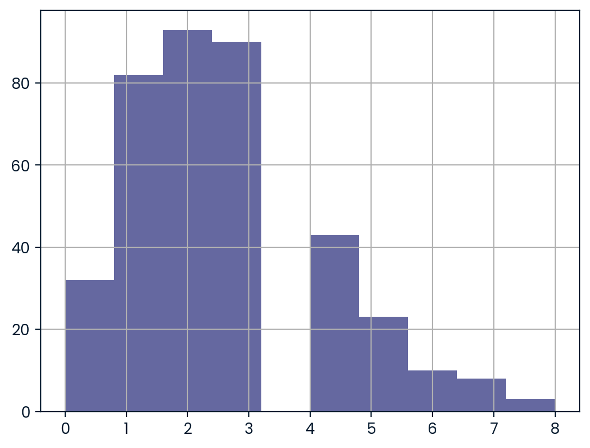
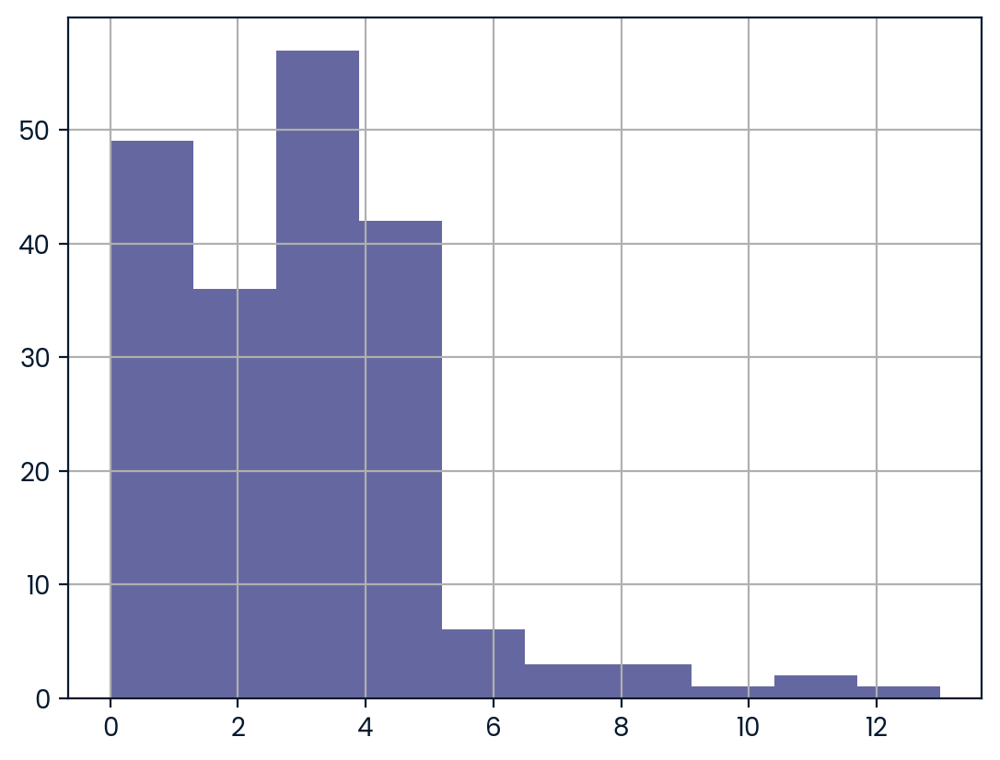

# Women's vs Men's International Soccer: Hypothesis Testing

## Overview
This project uses statistical hypothesis testing to determine whether the mean number of goals scored in women's international soccer matches differs from men's, using official FIFA World Cup matches since 2002-01-01.

## Objective
Test the null hypothesis that the mean number of goals scored is the same in women's and men's matches, against the alternative that women's matches have a higher mean number of goals scored, at a **10% significance level**.

- **H0:** Mean goals scored in women's matches = Mean goals scored in men's matches
- **HA:** Mean goals scored in women's matches > Mean goals scored in men's matches

## Method
1. Filtered both datasets to FIFA World Cup matches played after 2002-01-01.
2. Calculated total goals scored per match (home + away).
3. Checked the distribution of goals scored using histograms — both distributions were **right-skewed**, not normally distributed.

**Men's goals scored distribution:**


**Women's goals scored distribution:**


4. Since normality assumptions were violated, used the **Wilcoxon-Mann-Whitney U test** (non-parametric) instead of a t-test, run as a one-tailed ("greater") test.
5. Compared the resulting p-value against the 10% significance level to decide whether to reject or fail to reject the null hypothesis.

## Result

| Metric | Value |
|---|---|
| p-value | 0.0051 |
| Significance level | 0.10 |
| Decision | Reject the null hypothesis |

```python
result_dict = {'p_val': 0.005106609825443641, 'result': 'reject'}
```

## Interpretation
With a p-value of ~0.0051, well below the 10% significance threshold, there is statistically significant evidence that the mean number of goals scored in women's FIFA World Cup matches (since 2002) is **higher** than in men's matches.

## Tools Used
- Python
- pandas
- matplotlib
- scipy (`mannwhitneyu`)
- pingouin (`mwu`)

## Files
- `notebook.ipynb` — Full analysis code, with outputs included
- `README.md` — Project summary (this file)
- `images/` — Histogram images referenced in this README

## How to Run
1. Clone this repository
2. Install dependencies: `pip install pandas matplotlib scipy pingouin`
3. Open `notebook.ipynb` in Jupyter Notebook or JupyterLab
4. Run all cells to reproduce the analysis

## Data Source
Datasets (`men_results.csv` and `women_results.csv`) provided via [DataCamp](https://www.datacamp.com/) as part of a guided project.
